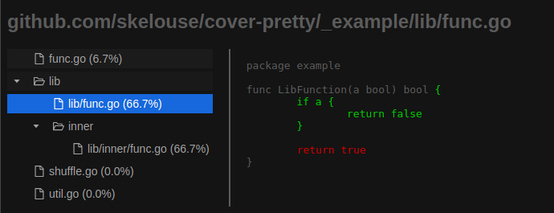

# cover-pretty

This is a simple tool to mimic the output of `go tool cover` but with a prettier html page.  Work in progress.



## Installation

```bash
go install github.com/skelouse/cover-pretty@latest
```

## Usage 

```bash
go test -v ./... -coverprofile cover.out -coverpkg ./...
cover-pretty -html || -func
```

## Example

```shell
go run .
```

cover-pretty will walk up the directory tree until it finds a `cover.out`  file.  Which so happens to be in the `_example` directory.


### Build

```shell
cd _example
go test -v ./... -coverprofile cover.out -coverpkg ./...
cd ..
go run .
```

## Semi-Live reloading
Run the [example](#Example) then

Optional Uncomment refresh line in [index.html](go/cover/index.html)

```shell
air
```